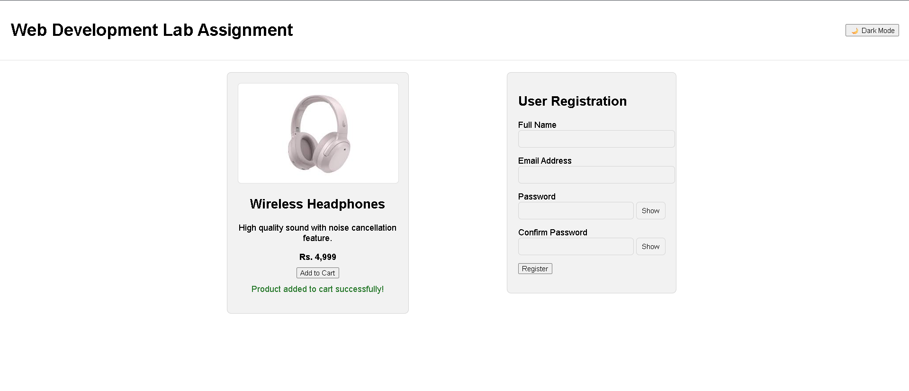
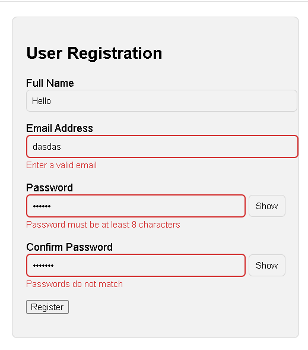

# Interactive Product Card and User Registration Form

## Description
This project is a responsive web page built using HTML, CSS, and Vanilla JavaScript.
It demonstrates form validation, UI interaction, error handling, and theme switching.

## Features
- Product card with Add to Cart functionality
- Image fallback handling
- User registration form with validation
- Real-time error messages
- Password show/hide toggle
- Dark mode and light mode with persistence
- No page reload on submission

## How to Run
1. Download or clone the repository
2. Open `index.html` in any modern browser
3. No server or dependencies required

## Screenshots

### Product Card (Light Mode)

### Form Validation Errors

### Dark Mode

## Technologies Used
- HTML5
- CSS3
- JavaScript (Vanilla)